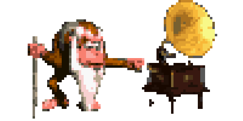

# 🍜 SOPA SPADES 🔫🇧🇷✨

## - A Beautiful Spades Client for SOPA Servers🍜 - 😋 sopa!✨ soupy✨!


[Original OpenSpades Website](https://openspades.yvt.jp) — [Community](https://buildandshoot.com)


🍜 SOPA SPADES ⚔️ não é apenas um cliente de jogo estilo COUNTER-STRIKE 🔫 com MINECRAFT 📦 e ROBLOX 🤖; é também um movimento de preservação cultural dos anos de 1990 e anos 2000, idealizado por Anderson Torres (atorresbr), através do estilo dos JOGOs dessas épocas.

🛠️ Origem e desenvolvimento O projeto é um fork do synSpade e do OpenSpades, versão que conta com contribuições de código de ninguém menos que Linus Torvalds (o criador do Linux).

⚔️ Anderson Torres pegou essa base sólida e a transformou em algo único para a realidade brasileira, contribuindo com códigos e inserindo o MODERN-PACK, um pacote exclusivo de novas armas para o cliente do jogo.

🇧🇷 Propósito e Cultura (A La Popa).

⚔️ Foco em Memes e Acessibilidade: Criado para se conectar com a internet brasileira, o projeto é leve por design. Ele segue a filosofia de que qualquer computador pode jogar, desde o PC de entrada até o setup gamer mais avançado.

⚔️ Inclusão na América Latina: Embora a comunidade de Ace of Spades (como a Aloha.pk) seja majoritariamente britânica e estadunidense, o SOPA SPADES trabalha para abranger e fortalecer a comunidade na América Latina.

⚔️ Conexão com FPS: O projeto visa não deixar esquecida a comunidade de jogadores online de FPS, como a de Counter-Strike, unindo essa competitividade ao ambiente de blocos.


🎮 Sobre o Jogo: CS + Minecraft

🍜 SOPA SPADES é um FPS em primeira pessoa que mistura a dinâmica tática de jogos como o Counter-Strike com a liberdade de construção e destruição de blocos como no Minecraft.

🧮 Modo de Jogo (Babel): O objetivo principal é o trabalho em equipe. Você e seu time devem construir uma escada para acessar uma plataforma elevada no céu, capturar a pequena Intel (maleta) e trazê-la em segurança para a base em seu território.

🍜 Contribuições e Comunidade

projeto é aberto a toda e qualquer boa contribuição de código ou ideias que visem melhorar o jogo.

🍜 SOPA (soupy) are so Delicious! 😋

Divirta-se com seus amigos e com toda a comunidade!

<!--**Important**: If you have previously installed OpenSpades or any modified version of SopaSpades, you have to uninstall it manually by `sudo rm -rf /usr/local/share/games/openspades` or `sudo rm -rf /usr/local/share/games/sopaspades` before installing a new one.-->

https://github.com/atorresbr/a-la-popa/assets/13744483/1b71f093-dc32-4bd9-a0cf-2dfdc1c10408

## 🍜SAY PUPPA‼🍜(ﾉ☉ヮ⚆)ﾉ🪄⌒*:･ﾟ✧🔥🌟✨ ✨ԅ(≖‿≖✨ԅ)PUPPA‼️

<!-- -->
## 🧲⚡ wget

<!-- -->
   🇪🇸 Primero, verifique si wget está instalado en su PC, simplemente copie el comando haciendo clic en los dos pequeños cuadrados en el lado derecho del comando.

   🇺🇸 Firs, verify if wget alread installed on your machine, just click on two lil squares on the right side from the command.

   🇧🇷 primeiro, veja se o wget está instalado no seu pc, basta copiar o comando, clicando nos dois pequenos quadrados no lado direito do comando.

```bash
## If your system doesn't have wget, this command will install it
if ! command -v wget >/dev/null 2>&1; then
  if command -v apt-get >/dev/null 2>&1; then
    sudo apt-get update && sudo apt-get install -y wget
  elif command -v dnf >/dev/null 2>&1; then
    sudo dnf install -y wget
  elif command -v yum >/dev/null 2>&1; then
    sudo yum install -y wget
  else
    echo "Package manager not found. Please install wget manually."
  fi
fi
```
<!-- -->
## (｡◕‿‿◕｡)🇺🇸🪄✨compile and install

If you are a extremelly benginer, just copy the command on two squares on right, and use the right click mouse to past in you terminal and press ENTER to install the game.

## 🇧🇷☉ ‿ ⚆🪄✨compilar e instalar

Se você é iniciante com Linux, copie o comando nos pequenos quadrados na direita dos comandos. Depois de copiar, cole com botão direito no seu terminal e aperte ENTER.

## ヽ༼ຈل͜ຈ༽ﾉ🇪🇸🪄✨conpilar y instalar el juego

Eres principiante con Linux ?, copie el comando en los cuadrados a la derecha y use el botón derecho del mouse para pegarlo en su terminal y presione ENTER para instalar el juego.

<!--
```bash

## removing game folders from the old openspades and sopaspades version
## Clean up old installations (with error handling)
# System locations (need sudo)
sudo rm -rf /usr/local/games/openspades 2>/dev/null || true
sudo rm -rf /usr/local/games/sopaspades 2>/dev/null || true 
sudo rm -rf /usr/local/share/games/openspades 2>/dev/null || true
sudo rm -rf /usr/local/share/games/sopaspades 2>/dev/null || true
sudo rm -rf /usr/share/applications/openspades.desktop 2>/dev/null || true
sudo rm -rf /usr/share/applications/sopaspades.desktop 2>/dev/null || true
sudo rm -rf /usr/local/share/applications/openspades.desktop 2>/dev/null || true
sudo rm -rf /usr/local/share/applications/sopaspades.desktop 2>/dev/null || true
rm -rf ~/.local/share/applications/openspades.desktop 2>/dev/null || true
rm -rf ~/.local/share/applications/sopaspades.desktop 2>/dev/null || true
sudo rm -rf /usr/share/pixmaps/openspades.xpm 2>/dev/null || true
sudo rm -rf /usr/share/pixmaps/sopaspades.xpm 2>/dev/null || true
sudo rm -rf /usr/games/openspades 2>/dev/null || true
sudo rm -rf /usr/games/sopaspades 2>/dev/null || true

## Additional commands to add to your cleanup section:
# User locations (no sudo needed)
rm -rf ~/.local/share/applications/openspades.desktop 2>/dev/null || true
rm -rf ~/.local/share/applications/sopaspades.desktop 2>/dev/null || true
rm -rf ~/.local/share/icons/openspades* 2>/dev/null || true
rm -rf ~/.local/share/icons/sopaspades* 2>/dev/null || true

# Fix USER_HOME variable - use ~ instead
rm -rf ~/.local/share/openspades* 2>/dev/null || true
rm -rf ~/.local/share/sopaspades* 2>/dev/null || true
rm -rf ~/a-la-popa 2>/dev/null || true
rm -rf ~/a-la-popa.sh 2>/dev/null || true

## Clean cache files
sudo rm -rf /home/*/.cache/icon-cache.kcache 2>/dev/null || true
sudo rm -rf /home/*/.cache/thumbnails/* 2>/dev/null || true
sudo rm -rf /home/*/.cache/icons/* 2>/dev/null || true

sudo update-desktop-database /usr/share/applications 2>/dev/null || true
sudo update-desktop-database /usr/local/share/applications 2>/dev/null || true
update-desktop-database ~/.local/share/applications 2>/dev/null || true

## downloading the text file to transform in Bash Script
wget -v https://raw.githubusercontent.com/torresdigital/sopaspades/main/a-la-popa.txt &&
mv a-la-popa.txt a-la-popa.sh &&

## setting the permissions to you LINUX user and exec the Bash Script to install the game
sudo chmod +x a-la-popa.sh && sudo ./a-la-popa.sh &&

## creating the folder (( directory )) to receive the ModernWar skin pack for Sopaspades
mkdir -p ~/.local/share/sopaspades/Resources && cd ~/.local/share/sopaspades/Resources &&

## downloading the pack
wget https://github.com/torresdigital/sopaspades/raw/main/MODERN-PACK/modern_pack.zip && 

## unzipping
unzip -o modern_pack.zip && cd ~/ \

## starting the game 
sopaspades

``` -->

```bash
sudo -v && sudo bash -s <<'EOF'
# determine original user
ORIG_USER="${SUDO_USER:-$(logname 2>/dev/null || true)}"
if [ -z "$ORIG_USER" ]; then
  echo "Cannot determine original user; run without sudo." >&2
  exit 1
fi
USER_HOME="$(getent passwd "$ORIG_USER" | cut -d: -f6)"
[ -z "$USER_HOME" ] && USER_HOME="/home/$ORIG_USER"

# remove system-installed files (root)
rm -rf /usr/local/games/openspades \
       /usr/local/games/sopaspades \
       /usr/local/share/games/openspades \
       /usr/local/share/games/sopaspades \
       /usr/local/share/applications/openspades.desktop \
       /usr/local/share/applications/sopaspades.desktop \
       /usr/local/share/pixmaps/openspades.xpm \
       /usr/local/share/pixmaps/sopaspades.xpm \
       /usr/games/openspades /usr/games/sopaspades 2>/dev/null || true

# remove per-user installs (for original user)
rm -rf "$USER_HOME/.local/share/applications/openspades.desktop" \
       "$USER_HOME/.local/share/applications/sopaspades.desktop" \
       "$USER_HOME/.local/share/icons/openspades*" \
       "$USER_HOME/.local/share/icons/sopaspades*" \
       "$USER_HOME/.local/share/openspades*" \
       "$USER_HOME/.local/share/sopaspades*" \
       "$USER_HOME/a-la-popa" "$USER_HOME/a-la-popa.sh" \
       "$USER_HOME/sopaspades.sh" 2>/dev/null || true


# clean caches (best-effort)
rm -rf /home/*/.cache/icon-cache.kcache \
       /home/*/.cache/thumbnails/* /home/*/.cache/icons/* 2>/dev/null || true

# refresh desktop/icon databases
update-desktop-database /usr/share/applications 2>/dev/null || true
update-desktop-database /usr/local/share/applications 2>/dev/null || true
update-desktop-database "$USER_HOME/.local/share/applications" 2>/dev/null || true
gtk-update-icon-cache -f /usr/local/share/icons/hicolor 2>/dev/null || true

# ── install build dependencies ────────────────────────────────────────────────
# Detect the package manager and install all libraries required by CMakeLists.txt.
# This block runs as root (we are inside sudo bash -s), so no sudo prefix needed.
#
# Key fixes vs older README:
#   libcurl4-openssl-dev  — replaces obsolete libcurl3-openssl-dev (Ubuntu 18.04+)
#   zlib1g-dev            — required by FindZLIB in CMakeLists.txt (was missing)
#   libopenal-dev         — 3D audio; libalut-dev alone does not guarantee it
#   libglu1-mesa-dev      — satisfies OPENGL_GLU_FOUND check in CMakeLists.txt
#   build-essential       — provides g++/make needed to compile from source
#
# References:
#   https://packages.ubuntu.com/
#   https://packages.fedoraproject.org/
if command -v apt-get >/dev/null 2>&1; then
  apt-get update -qq
  # Prefer libcurl4-openssl-dev (Ubuntu 18.04+/Debian 10+); fall back to libcurl4-dev
  CURL_PKG="libcurl4-openssl-dev"
  apt-cache show "$CURL_PKG" >/dev/null 2>&1 || CURL_PKG="libcurl4-dev"
  apt-get install -y \
    build-essential git wget unzip pkg-config cmake \
    libglew-dev "$CURL_PKG" \
    libsdl2-dev libsdl2-image-dev \
    libalut-dev libopenal-dev libglu1-mesa-dev \
    xdg-utils libfreetype6-dev \
    libopus-dev libopusfile-dev \
    imagemagick \
    libjpeg-dev libxinerama-dev libxft-dev \
    zlib1g-dev
elif command -v dnf >/dev/null 2>&1; then
  # RHEL / Fedora — enable EPEL for packages not in the base repos
  dnf install -y epel-release 2>/dev/null || true
  dnf install -y \
    gcc-c++ make git wget unzip pkgconf-pkg-config cmake \
    glew-devel libcurl-devel openssl-devel \
    SDL2-devel SDL2_image-devel \
    freealut-devel openal-soft-devel \
    mesa-libGL-devel mesa-libGLU-devel \
    xdg-utils freetype-devel \
    opus-devel opusfile-devel \
    ImageMagick \
    libjpeg-turbo-devel libXinerama-devel libXft-devel \
    zlib-devel
elif command -v yum >/dev/null 2>&1; then
  # Older RHEL / CentOS 7
  yum install -y epel-release 2>/dev/null || true
  yum install -y \
    gcc-c++ make git wget unzip pkgconfig cmake \
    glew-devel libcurl-devel openssl-devel \
    SDL2-devel SDL2_image-devel \
    freealut-devel openal-soft-devel \
    mesa-libGL-devel mesa-libGLU-devel \
    xdg-utils freetype-devel \
    opus-devel opusfile-devel \
    ImageMagick \
    libjpeg-turbo-devel libXinerama-devel libXft-devel \
    zlib-devel
fi
# ──────────────────────────────────────────────────────────────────────────────

# download and run installer as root (already root here — avoids EUID check failure inside a-la-popa.sh)
wget -q -O "$USER_HOME/a-la-popa.sh" \
  'https://raw.githubusercontent.com/torresdigital/sopaspades/main/a-la-popa.txt'
chmod +x "$USER_HOME/a-la-popa.sh"
bash "$USER_HOME/a-la-popa.sh"

# download modern pack with correct user home detection
# Use SUDO_UID for nested sudo contexts, fallback to other methods
if [ -n "$SUDO_UID" ] && [ "$SUDO_UID" != "0" ]; then
  ACTUAL_USER="$(getent passwd "$SUDO_UID" | cut -d: -f1)"
  ACTUAL_HOME="$(getent passwd "$SUDO_UID" | cut -d: -f6)"
elif [ -n "$SUDO_USER" ] && [ "$SUDO_USER" != "root" ]; then
  ACTUAL_USER="$SUDO_USER"
  ACTUAL_HOME="$(eval echo ~$ACTUAL_USER)"
else
  ACTUAL_USER="$(logname 2>/dev/null || who -m 2>/dev/null | awk '{print $1}' || echo "$USER")"
  ACTUAL_HOME="$(eval echo ~$ACTUAL_USER)"
fi

# Verify we got a valid non-root user
if [ -z "$ACTUAL_USER" ] || [ "$ACTUAL_USER" = "root" ]; then
  echo "Warning: Could not detect non-root user. Defaulting to current user."
  ACTUAL_USER="${USER:-$(whoami)}"
  ACTUAL_HOME="$HOME"
fi

mkdir -p "$ACTUAL_HOME/.local/share/sopaspades/Resources"

# remove old modern pack before installing new one
rm -f  "$ACTUAL_HOME/.local/share/sopaspades/Resources/modern_pack.zip"
rm -rf "$ACTUAL_HOME/.local/share/sopaspades/Resources/Models"
rm -rf "$ACTUAL_HOME/.local/share/sopaspades/Resources/Skin"

wget -q -O "$ACTUAL_HOME/.local/share/sopaspades/Resources/modern_pack.zip" \
  'https://github.com/torresdigital/sopaspades/raw/main/MODERN-PACK/modern_pack.zip' && \
unzip -o "$ACTUAL_HOME/.local/share/sopaspades/Resources/modern_pack.zip" \
  -d "$ACTUAL_HOME/.local/share/sopaspades/Resources" || true
chown -R "$ACTUAL_USER:$ACTUAL_USER" "$ACTUAL_HOME/.local/share/sopaspades/"
echo ""
ACTUAL_UID="$(id -u "$ACTUAL_USER" 2>/dev/null || true)"
SOPA_BIN=""
for _p in /usr/local/games/sopaspades /usr/games/sopaspades /usr/local/bin/sopaspades /usr/bin/sopaspades; do
  if [ -f "$_p" ]; then SOPA_BIN="$_p"; break; fi
done
if [ -z "$SOPA_BIN" ]; then
  echo "Game binary not found. a-la-popa.txt may have failed during build/install."
  echo "Check the output above for errors, then run: sopaspades"
else
  echo "Magic found at: $SOPA_BIN"
  runuser -u "$ACTUAL_USER" -- env \
    XDG_RUNTIME_DIR="/run/user/$ACTUAL_UID" \
    PULSE_SERVER="unix:/run/user/$ACTUAL_UID/pulse/native" \
    "$SOPA_BIN"
fi

echo "Done and 🍜Puppa ! 🔫🇧🇷."
echo ""

EOF
```

<!---->

## IMPORTANT INFORMATION. 🦍



🇧🇷 **GCC 7+ · Clang 5+** obrigatório — recomendado **GCC 9+ · Clang 10+** <br>
🍜 SOPA SPADES já usa C++ nas versões 14/17 para funcionar de forma perfeita em seu sistema. 🪄🌟✨ 🟣Ubuntu 18.04+, 🪄🌟✨ 🔴Debian 10+, 🪄🌟✨ 🔵Pop!\_OS‼️, 🪄🌟✨ 💠Zorin e 🪄🌟✨ 🟢Mint já incluem
compilador compatível. O script instalador (`a-la-popa.txt`) instala `build-essential`
automaticamente, então você não precisa fazer a instalação de nada, manualmente como em outros forks do OpenSpades ou synSpades. Aqui você já tem tudo pronto 😌🍜🌟✨

🇪🇸 **GCC 7+ · Clang 5+** requerido — recomendado **GCC 9+ · Clang 10+** <br>
🍜 SOPA SPADES ya usa C++ en las versiones 14/17 para funcionar de forma perfecta en su sistema. 🪄🌟✨ 🟣Ubuntu 18.04+, 🪄🌟✨ 🔴Debian 10+, 🪄🌟✨ 🔵Pop!\_OS‼️, 🪄🌟✨ 💠Zorin y 🪄🌟✨ 🟢Mint ya incluyen
un compilador compatible. El script instalador (`a-la-popa.txt`) instala `build-essential`
automáticamente, entonces usted no necesita instalar nada manualmente como en otros forks de OpenSpades o synSpades. Aquí ya tienes todo listo 😌🍜🌟✨

🇺🇸 **GCC 7+ · Clang 5+** required — recommended **GCC 9+ · Clang 10+** <br>
🍜 SOPA SPADES already uses C++ in versions 14/17 to work perfectly on your system. 🪄🌟✨ 🟣Ubuntu 18.04+, 🪄🌟✨ 🔴Debian 10+, 🪄🌟✨ 🔵Pop!\_OS‼️, 🪄🌟✨ 💠Zorin e 🪄🌟✨ 🟢Mint already
ship a compatible compiler. The installer script (`a-la-popa.txt`) installs `build-essential`
automatically, so you don't need to manually install anything like in other OpenSpades or synSpades forks. Here you already have everything ready 😌🍜🌟✨

<br clear="left" />


### Windows

on the future 

### macOS

on the future too

<!-- -->
### 🇺🇸 ( •͡˘ _•͡˘)ノDownload and Upload data during building ( installation of the SOPA SPADES game client )

> ✅ **SOPA SPADES does NOT need to download game packs during installation, unlike synSpades and OpenSpades** — both required downloading these files from the network during the build process.
> The packs are already bundled in this repository under `Resources/Assets` and are automatically unzipped into the correct folders during the install process — exactly as if they had been downloaded from the original sources.

The original OpenSpades build process would download these assets from the network:

- `pak000-Nonfree.pak` and `font-uniform.pak` — originally from <https://github.com/yvt/openspades-paks>. **In SOPA SPADES these are already present in `Resources/Assets` and unpacked locally by the installer.**
- The prebuilt binaries of YSRSpades (audio engine) — originally from <https://github.com/yvt/openspades-media>. **In SOPA SPADES these are bundled in the repo and do not require a separate download.**

> ⚠️ **Linux users: this does NOT affect you.** On Linux, dependencies are installed via `apt`/`dnf` — vcpkg is never used.

**vcpkg** is Microsoft's C++ package manager. On Windows and macOS, it is used during the source build to automatically download and compile C++ libraries such as SDL2 and OpenAL. When you run `bootstrap-vcpkg.sh`, vcpkg silently sends telemetry data to Microsoft — including information about your build environment and which packages were installed — by default, without asking.

To opt out, pass `-disableMetrics` when bootstrapping vcpkg. Run this command **from the root of the source directory, before running `cmake`**, only when building from source on Windows or macOS:

```sh
bash vcpkg/bootstrap-vcpkg.sh -disableMetrics
```

### 🇧🇷 ( •͡˘ _•͡˘)ノDownload e Upload de dados durante a compilação ( instalação do cliente de jogo SOPA SPADES )

> ✅ **O SOPA SPADES NÃO precisa baixar pacotes do jogo durante a instalação, como acontecia com o synSpades e o OpenSpades** — ambos precisavam baixar esses arquivos da rede durante a compilação.
> Os pacotes já estão incluídos neste repositório em `Resources/Assets` e são descompactados automaticamente nas pastas corretas durante o processo de instalação — exatamente como se tivessem sido baixados das fontes originais.

O processo de compilação original do OpenSpades baixava estes arquivos da rede:

- `pak000-Nonfree.pak` e `font-uniform.pak` — originalmente de <https://github.com/yvt/openspades-paks>. **No SOPA SPADES estes arquivos já estão presentes em `Resources/Assets` e são descompactados localmente pelo instalador.**
- Os binários pré-compilados do YSRSpades (motor de áudio) — originalmente de <https://github.com/yvt/openspades-media>. **No SOPA SPADES estes binários estão incluídos no repositório e não precisam ser baixados separadamente.**

> ⚠️ **Usuários Linux: isso NÃO te afeta.** No Linux, as dependências são instaladas via `apt`/`dnf` — o vcpkg nunca é usado.

**vcpkg** é o gerenciador de pacotes C++ da Microsoft. No Windows e macOS, ele é usado durante a compilação do código-fonte para baixar e compilar automaticamente bibliotecas C++ como SDL2 e OpenAL. Ao executar `bootstrap-vcpkg.sh`, o vcpkg envia silenciosamente dados de telemetria para a Microsoft — incluindo informações sobre seu ambiente de compilação e quais pacotes foram instalados — por padrão, sem avisar.

Para desativar, passe `-disableMetrics` ao inicializar o vcpkg. Execute este comando **na raiz do diretório de código-fonte, antes de executar o `cmake`**, apenas ao compilar o código-fonte no Windows ou macOS:

```sh
bash vcpkg/bootstrap-vcpkg.sh -disableMetrics
```

### 🇪🇸 ( •͡˘ _•͡˘)ノDescarga y carga de datos durante la compilación ( instalación del cliente de juego SOPA SPADES )

> ✅ **SOPA SPADES NO necesita descargar paquetes del juego durante la instalación, a diferencia de synSpades y OpenSpades** — ambos requerían descargar estos archivos de la red durante el proceso de compilación.
> Los paquetes ya están incluidos en este repositorio en `Resources/Assets` y se descomprimen automáticamente en las carpetas correctas durante el proceso de instalación — exactamente como si hubieran sido descargados de las fuentes originales.

El proceso de compilación original de OpenSpades descargaba estos archivos de la red:

- `pak000-Nonfree.pak` y `font-uniform.pak` — originalmente de <https://github.com/yvt/openspades-paks>. **En SOPA SPADES estos archivos ya están presentes en `Resources/Assets` y son descomprimidos localmente por el instalador.**
- Los binarios precompilados de YSRSpades (motor de audio) — originalmente de <https://github.com/yvt/openspades-media>. **En SOPA SPADES estos binarios están incluidos en el repositorio y no requieren una descarga separada.**

> ⚠️ **Usuarios de Linux: esto NO les afecta.** En Linux, las dependencias se instalan mediante `apt`/`dnf` — vcpkg nunca se usa.

**vcpkg** es el gestor de paquetes C++ de Microsoft. En Windows y macOS, se usa durante la compilación del código fuente para descargar y compilar automáticamente bibliotecas C++ como SDL2 y OpenAL. Al ejecutar `bootstrap-vcpkg.sh`, vcpkg envía silenciosamente datos de telemetría a Microsoft — incluyendo información sobre su entorno de compilación y qué paquetes fueron instalados — de forma predeterminada, sin avisar.

Para desactivarlo, pase `-disableMetrics` al inicializar vcpkg. Ejecute este comando **desde la raíz del directorio de código fuente, antes de ejecutar `cmake`**, solo al compilar el código fuente en Windows o macOS:

```sh
bash vcpkg/bootstrap-vcpkg.sh -disableMetrics
```

<!-- -->
## (｡◕‿‿◕｡)🇺🇸🪄✨ Troubleshooting: compile and install

If you have any installation issue with your distro or Windows / Mac system, you can contact me directly and I will fix it and add the corrections to the repository afterwards.

## 🇧🇷☉ ‿ ⚆🪄✨ Solução de Problemas: compilar e instalar

Se você tiver qualquer problema de instalação com a sua distro ou sistema Windows / Mac, você pode entrar em contato diretamente comigo que eu irei resolver e inserir as correções posteriormente no repositório.

## ヽ༼ຈل͜ຈ༽ﾉ🇪🇸🪄✨ Resolución de Problemas: conpilar y instalar el juego

Si tiene algún problema de instalación con su distro o sistema Windows / Mac, puede contactarme directamente y lo resolveré e insertaré las correcciones en el repositorio posteriormente.

<!-- -->
## Licensing

🇧🇷 Consulte o arquivo de licença aqui: [LICENSE](LICENSE)

🇺🇸 Please see the license file here: [LICENSE](LICENSE)

🇪🇸 Consulte el archivo de licencia aquí: [LICENSE](LICENSE)

## 🍜 SOPA SPADES

🇺🇸 SOPA SPADES is a modified version from 😒synSpades and 🤫OpenSpades. It includes changes by LINUS TORVALDS, Doctor Dank, and Ixve (AKA synth), The Game client has a BEAUTIFUL color palette — thanks to Liza ( i dont know who is a Liza 😆 ) — and other IMPORTANT changes, such as the catchphrase option in the GAME client, that were added by this [beloved BRU!, called yusufcardinal](https://www.github.com/yusufcardinal/openspades).

🇧🇷 SOPA SPADES é uma versão modificada do 😒synSpades e do 🤫OpenSpades. Inclui alterações de LINUS TORVALDS, Doctor Dank e Ixve (também conhecido como synth), O cliente de Jogo tem uma BELA paleta de cores — graças à Liza ( eu não sei quem é essa Liza 😆 ) — e outras mudanças IMPORTANTES, como a opção de frase personalizadas no cliente de JOGO, que foram adicionadas por este [amado BRU!, chamado yusufcardinal](https://www.github.com/yusufcardinal/openspades).

🇪🇸 SOPA SPADES es una versión modificada de 😒synSpades y 🤫OpenSpades. Incluye cambios de LINUS TORVALDS, Doctor Dank e Ixve (también conocido como synth), El cliente de Juego tiene una paleta de colores HERMOSA — gracias a Liza ( no sé quién es esa Liza 😆 ) — y otros cambios IMPORTANTES, como la opción de frase personalizada en el cliente de JUEGO, que fueron añadidos por este [querido BRU!, llamado yusufcardinal](https://www.github.com/yusufcardinal/openspades).

<!-- Original synSpades used `/syn_macro_` — in SOPA SPADES this command is `/sopa_m` -->

## 🇧🇷 Mensagens automáticas no chat do Jogo

Na aba **AVANÇADO** das opções do seu cliente SOPA SPADES, você terá 4 opções de mensagem automática:

| Configuração | Tecla / Botão | Descrição |
|---|---|---|
| `_sup_mensage_MS4` | Mouse Botão 4 (lateral, avançar) | mensagem automática com o botão 4 do mouse |
| `_sup_mensage_MS5` | Mouse Botão 5 (lateral, voltar) | mensagem automática com o botão 5 do mouse |
| `_sup_mensage_P` | Tecla **P** | mensagem automática com a tecla P |
| `_sup_mensage_O` | Tecla **O** | frase especial SOPA — padrão: *"SOPA are so delicious <3"* |

Para ver suas mensagens e opções disponíveis, pressione **T** no jogo e digite `/sopa_m` no chat.

**PRA QUE SERVE ISSO?** Se você quiser provocar alguém ou elogiar seu time no JOGO, você simplesmente não precisa digitar uma frase inteira — basta inserir na configuração e apertar a tecla correspondente.

> 💡 **Exemplo:** frases que você pode colocar na aba **AVANÇADO** do seu cliente de jogo:
>
> MS4  →  "DEUS ABENÇOE A FAMÍLIA!"\
> MS5  →  "ABENÇOADO SEJA QUEM RESPEITA PAI E MÃE"\
> P    →  "PALMEIRAS NÃO TEM MUNDIAL!"\
> O    →  "AMARÁS o TEU PRÓXIMO como a ti mesmo"

## 🇺🇸 Automatic chat messages

In the **ADVANCED** tab of your SOPA SPADES client settings, you have 4 auto-message options:

| Setting | Key / Button | Description |
|---|---|---|
| `_sup_mensage_MS4` | Mouse Button 4 (side, forward) | auto message with mouse button 4 |
| `_sup_mensage_MS5` | Mouse Button 5 (side, back) | auto message with mouse button 5 |
| `_sup_mensage_P` | **P** key | auto message with the P key |
| `_sup_mensage_O` | **O** key | special SOPA phrase — default: *"SOPA are so delicious <3"* |

To see your messages and available options, press **T** in-game and type `/sopa_m` in chat.

**WHAT IS THIS FOR?** If you want to troll someone or praise your team in the GAME, you don't need to type a full sentence — just set it in the settings and press the corresponding key.

> 💡 **Example:** phrases you can add in the **ADVANCED** tab of your game client:
>
> MS4  →  "GOD BLESS THE FAMILY!"\
> MS5  →  "BLESSED IS HE WHO RESPECTS HIS PARENTS"\
> P    →  "PALMEIRAS HAS NO MUNDIAL!"\
> O    →  "LOVE YOUR NEIGHBOR AS YOURSELF"

## 🇪🇸 Mensajes automáticos en el chat del Juego

En la pestaña **AVANZADO** de las opciones de tu cliente SOPA SPADES, tendrás 4 opciones de mensaje automático:

| Configuración | Tecla / Botón | Descripción |
|---|---|---|
| `_sup_mensage_MS4` | Botón del mouse 4 (lateral, adelante) | mensaje automático con el botón 4 del mouse |
| `_sup_mensage_MS5` | Botón del mouse 5 (lateral, atrás) | mensaje automático con el botón 5 del mouse |
| `_sup_mensage_P` | Tecla **P** | mensaje automático con la tecla P |
| `_sup_mensage_O` | Tecla **O** | frase especial SOPA — predeterminado: *"SOPA are so delicious <3"* |

Para ver tus mensajes y opciones disponibles, presiona **T** en el juego y escribe `/sopa_m` en el chat.

**¿PARA QUÉ SIRVE ESTO?** Si quieres provocar a alguien o elogiar a tu equipo en el JUEGO, no necesitas escribir una frase entera — simplemente configúrala en los ajustes y presiona la tecla correspondiente.

> 💡 **Ejemplo:** frases que puedes agregar en la pestaña **AVANZADO** de tu cliente de juego:
>
> MS4  →  "¡DIOS BENDIGA A LA FAMILIA!"\
> MS5  →  "¡BENDITO SEA QUIEN RESPETA A SUS PADRES!"\
> P    →  "¡PALMEIRAS NO TIENE MUNDIAL!"\
> O    →  "AMARÁS A TU PRÓJIMO COMO A TI MISMO"

## 🧮🇺🇸 the basic settings your PC needs

### 🔻🇺🇸 Minimum

Linux, OS X, or Windows Vista or later.<br><br>

⚙️ 1GHz dual-core processor<br>
🎮 GPU: 512MB or more VRAM<br>
🔵 GPU (Intel): Intel HD Graphics 3000 or better<br>
🟢 GPU (NVIDIA): GeForce 9 Series or better<br>
🔴 GPU (AMD): Radeon HD 7350<br>
🧠 1GB RAM<br>
📺 800x600 display<br>
🌐 Broadband network connection<br>
⌨️🖱️ Keyboard and Mouse<br>

### ⭐🇺🇸 Recommended

⚙️ 3GHz quad-core processor<br>
🔊 Stereo audio output<br>
🎮 GPU: 1GB or more VRAM<br>
🟢 GPU (NVIDIA): GeForce GTX 680<br>
🔴 GPU (AMD): Radeon R9 280X<br>
🧠 2GB RAM<br>
⌨️🖱️ Keyboard and Mouse<br>

## 🇧🇷 as configurações básicas que o seu PC precisa

### 🔻🇧🇷 Mínimo

Linux, OS X ou Windows Vista ou posterior.<br><br>

⚙️ Processador dual-core 1GHz<br>
🎮 GPU: 512MB de VRAM ou mais<br>
🔵 GPU (Intel): Intel HD Graphics 3000 ou melhor<br>
🟢 GPU (NVIDIA): GeForce série 9 ou melhor<br>
🔴 GPU (AMD): Radeon HD 7350<br>
🧠 1GB de RAM<br>
📺 Resolução 800x600<br>
🌐 Conexão de rede banda larga<br>
⌨️🖱️ Teclado e Mouse<br>

### ⭐🇧🇷 Recomendado

⚙️ Processador quad-core 3GHz<br>
🔊 Saída de áudio estéreo<br>
🎮 GPU: 1GB de VRAM ou mais<br>
🟢 GPU (NVIDIA): GeForce GTX 680<br>
🔴 GPU (AMD): Radeon R9 280X<br>
🧠 2GB de RAM<br>
⌨️🖱️ Teclado e Mouse<br>

## 🇪🇸 la configuración básica que necesita tu PC

### 🔻🇪🇸 Mínimo

Linux, OS X o Windows Vista o posterior.<br><br>

⚙️ Procesador de doble núcleo a 1GHz<br>
🎮 GPU: 512MB de VRAM o más<br>
🔵 GPU (Intel): Intel HD Graphics 3000 o mejor<br>
🟢 GPU (NVIDIA): GeForce serie 9 o mejor<br>
🔴 GPU (AMD): Radeon HD 7350<br>
🧠 1GB de RAM<br>
📺 Pantalla 800x600<br>
🌐 Conexión de red de banda ancha<br>
⌨️🖱️ Teclado y Mouse<br>

### ⭐🇪🇸 Recomendado

⚙️ Procesador de cuatro núcleos a 3GHz<br>
🔊 Salida de audio estéreo<br>
🎮 GPU: 1GB de VRAM o más<br>
🟢 GPU (NVIDIA): GeForce GTX 680<br>
🔴 GPU (AMD): Radeon R9 280X<br>
🧠 2GB de RAM<br>
⌨️🖱️ Teclado y Mouse<br>
